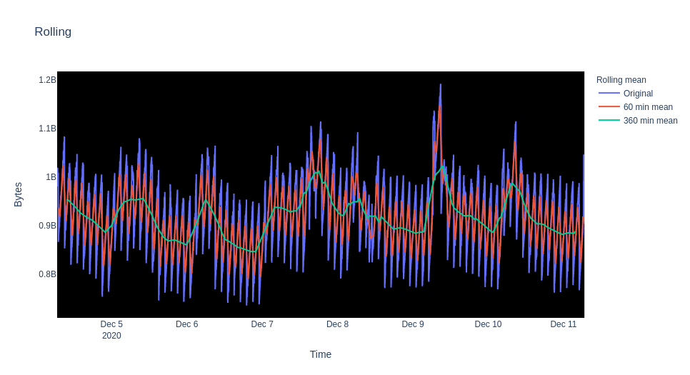

# Time series data analysis 

## Monitoring cloud applications

Time series data is a collection of chronological observations. There are important classes of problems defined for these ubiquitous temporal data. Data science solutions for these problems benefit several industries such as healthcare, finance, services, systems, and software. In this series of notebooks, we are going to analyze time series data generated by cloud applications. The architecture of these applications make time series analysis critical and to better monitor these applications and infrastructure, we will discuss common time series data problems and demo example solutions. 

Cloud native development offers scalable and fault tolerant applications that can be located anywhere on public, private, or hybrid clouds [[1](https://www.redhat.com/en/topics/cloud)]. The applications are a collection of loosely coupled services that offer efficient scaling and flexibility in language and frameworks used. These services are packaged in _containers_ that provide a layer of abstraction over physical cloud resources. Consider a simple example of an application with three separate services: Node.js for front end, Python for backend API, and PostgreSQL for database. The health of the application depends on the effective interaction of these services. In case of performance degradation, metrics generated from all the containers have to be investigated.

Following this architecture with loosely coupled services introduces new challenges. The complexity of the application makes observability a daunting task. Observability refers to the monitoring of external system variables in order to understand the state of the systems [[2](https://thenewstack.io/observability-a-3-year-retrospective/)]. The use of containers provides an abstract layer over physical resources but they also increase the number of hops for a single application request. This complicates the search for the root cause of a problem or a performance bottleneck.

For monolithic architectures, monitoring using metrics is a viable solution as the system is less complex. However, with cloud applications, it is inefficient to manually monitor the large number of generated metrics. We need automated ways of finding root causes and incidents. Data science with time series metric data can help with reducing the search space by providing concise visualizations and potential hotspots for specific real time problems.

In the coming notebooks, we are going to discuss how we can manipulate, visualize, and learn from the time series metrics data. We will apply the existing statistical analysis and machine learning algorithms to come up with meaningful insights to solve common cloud monitoring issues.

## Table of contents

1. [Introduction](/README.md)

2. [Fetching metrics data](/notebooks/ts-1-fetching-metrics.ipynb)

3. [Manipulating and visualizing metrics data](/notebooks/ts-2-visualization.ipynb)

 
